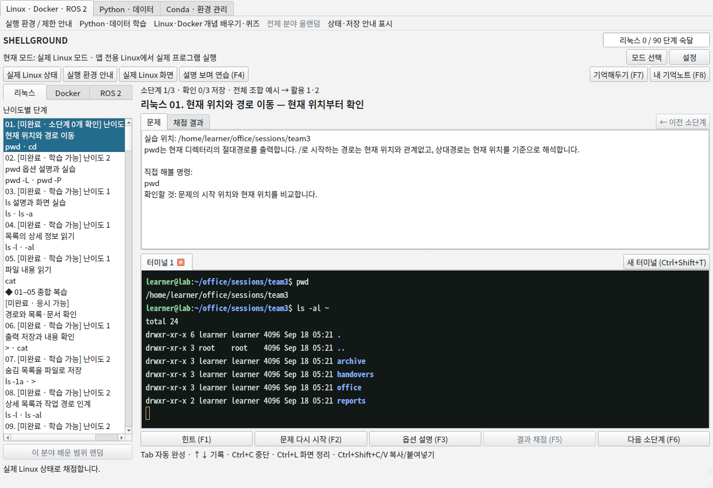
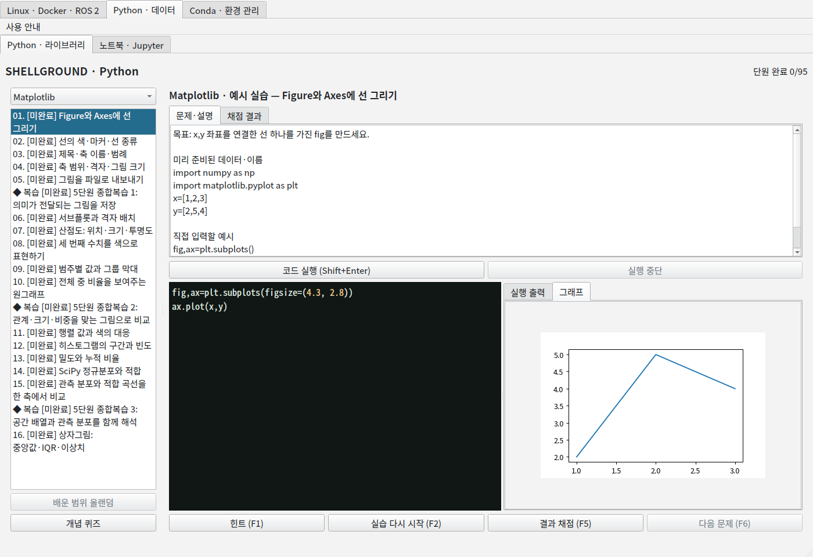
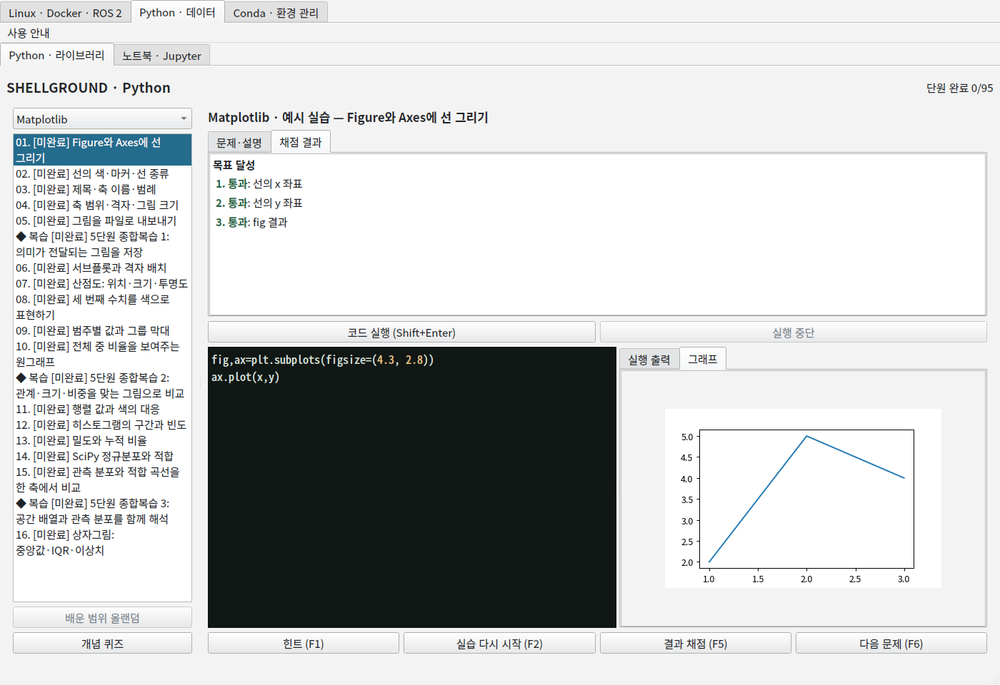
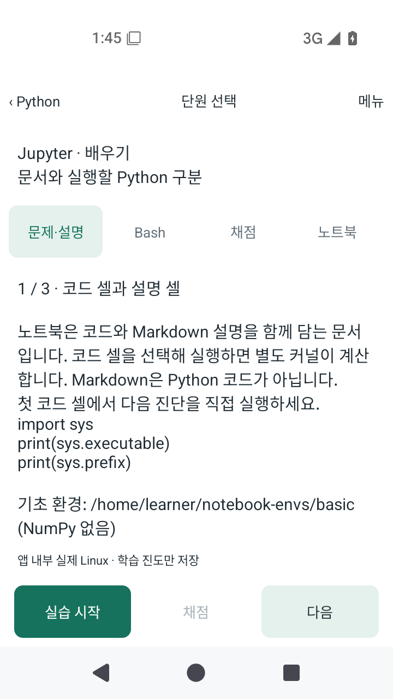

<div align="center">

# Shellground

### 읽고, 직접 해보고, 결과를 확인하는 실습.

**Linux · Docker · ROS 2 · Python · Conda · Jupyter**를 연습하는 네이티브 학습 프로그램

[English](README.md) · **한국어**

[다운로드](https://github.com/kimwoo666/shellground/releases) · [시작하기](docs/GETTING_STARTED.ko.md) · [운영체제별 확인 범위](docs/PLATFORMS.md)

</div>

## 4.7.6 업데이트

**기기를 바꿔도 NAS로 진도를 이어갑니다.** 개인 NAS 연결은 기기별로 설정하며 주소·계정·비밀번호는 배포본에 포함하지 않습니다. [NAS 설정](docs/NAS_SYNC.ko.md) · [전체 변경 사항](docs/RELEASE_4.7.6.md)

pandas는 기존 내용을 유지하면서 **81개 설명·실행 소단계**로 익힙니다. Matplotlib은 현재 그림을 먼저 보여 주고 여러 그림 선택과 오류 표시를 지원합니다.



명령어를 한 번 따라 치고 끝내지 않습니다. 짧은 설명을 읽고 직접 실행한 다음, 조건이 다른 활용 문제와 이전 내용을 섞은 복습으로 이어집니다. 정답 문자열이 아니라 **작업 후의 파일·프로세스·변수·표·그래프**를 확인해 채점합니다.

웹사이트나 WebView가 아닌 **설치해서 사용하는 프로그램**입니다. 현재 학습 내용과 UI는 한국어이며 소개·시작 안내는 한국어와 영어를 제공합니다.

## 이렇게 배웁니다

1. **새 개념 배우기** — 내용을 소단계로 나누고 설명을 보면서 직접 연습합니다.
2. **예시 실습** — 시작 위치, 입력 자료, 목표를 확인하며 사용법을 익힙니다.
3. **활용 문제** — 손상된 상태 복구, 원본 보존, 이전 기능 조합을 연습합니다.
4. **항목별 채점** — 틀려도 처음부터 할 필요 없이 같은 실습에서 고쳐 다시 채점합니다.
5. **종합 복습·올랜덤** — 앞서 배운 내용을 섞어 기억을 되살립니다.

완료한 학습과 소단계 위치는 자동 저장합니다. 타이핑한 코드, 터미널 세션, 임시 실습 파일 전체를 영구 저장하는 프로그램은 아닙니다.

## 분야별 학습 과정

| 분야 | 포함된 학습 자료 |
| --- | --- |
| Linux | 90단원 + 18복습: 경로, 파일, 따옴표, 편집기, 입출력, 권한, 계정, 패키지, 프로세스 |
| Docker | 25단원 + 5복습: 이미지, 컨테이너, 레지스트리, 파일, 볼륨, 네트워크, 빌드, 수명과 자원 관찰 |
| ROS 2 | 23단원 + 4복습: 작업공간, 노드, 토픽, 서비스, 매개변수, launch, bag, 터미널 조작 |
| Python·데이터 | 학습·복습 95항목, 285문제: Python, NumPy, Matplotlib, pandas, SciPy, Seaborn, scikit-learn |
| Conda·pip | 학습·복습 20항목, 60문제 + 선택 설치 실습 |
| Jupyter | 학습·복습 6항목, 18문제: 실제 커널 선택, 셀 실행 순서, 상태, 환경, 노트북 저장 |

이 숫자는 수록된 과정의 규모입니다. 강의에 언급된 모든 세부 옵션이나 모든 하드웨어 기능의 구현 완료를 뜻하지 않습니다. [현재 범위와 제한](docs/PLATFORMS.md)을 구분해 안내합니다.

## 실행 결과를 보고, 부족한 부분만 고칩니다



**코드와 결과를 함께 확인합니다.** 내장 CPython과 과학 라이브러리가 코드를 실행합니다. 그래프 문제는 실제 그림 객체의 데이터와 축을 검사합니다.



**미완료 항목만 이어서 해결합니다.** 문제와 채점 결과가 같은 공간을 탭으로 공유합니다. 문제로 돌아가도 실습 상태가 초기화되지 않습니다.

<p align="center"></p>

**Android에서도 PC 연결 없이 실행합니다.** 설명·터미널·노트북·채점 탭을 나누어 작은 화면을 활용합니다. Linux 기반 과정은 앱에 포함된 ARM64 Linux 환경에서 실행합니다.

소개 이미지는 앱을 직접 실행해 캡처한 화면이며 시안이 아닙니다. 데스크톱 이미지는 Linux 화면으로, Windows 실기기 검증 화면이 아닙니다.

## 다운로드와 실행

**내 OS의 파일 하나만 받으면 됩니다.** 설치파일을 열어 설치한 뒤 시작 메뉴·앱 메뉴의 **Shellground**를 실행하세요. 조각 파일이나 합치기 스크립트는 필요 없습니다. PC는 첫 설치에서 약 8.1GB의 자료를 자동으로 받으므로 인터넷과 약 9GB 여유 공간이 필요하며, 설치 후 포함된 과정은 오프라인 사용이 가능합니다. Android는 APK 하나로 설치합니다.

| 운영체제 | 배포 형식 | 확인한 범위 |
| --- | --- | --- |
| Linux x86-64 | [Linux 설치파일.run](https://github.com/kimwoo666/shellground/releases/download/v4.7.6/Shellground-Linux-Setup.run) | NAS·문제·그래프 업데이트 · [변경 사항](docs/RELEASE_4.7.6.md) |
| Windows x64 | [Windows 설치파일.exe](https://github.com/kimwoo666/shellground/releases/download/v4.7.6/Shellground-Windows-Setup.exe) | NAS·문제·그래프 업데이트 · [검증 범위](docs/PLATFORMS.md) |
| Android | [Android.apk](https://github.com/kimwoo666/shellground/releases/download/v4.7.6/Shellground-4.7.6-Android.apk) | NAS·소단계·그래프 업데이트. **ARM 실휴대폰은 미검증** |
| macOS | 없음 | 이번 배포에 포함하지 않음 |

일반 사용자가 Python·Docker·Conda·WSL·Termux·실습 서버를 따로 설치하지 않습니다. 포함된 Linux 환경은 부팅 시간이 필요하고 Python 전용 실습보다 메모리를 더 사용합니다. 인증서 서명/스토어 심사를 받은 제품은 아닙니다.

[처음 실행하는 방법](docs/GETTING_STARTED.ko.md)을 참고하세요. PC에서는 **Shift+Enter**로 Python 실행, **F1** 힌트, **F5** 채점, **F6** 다음 단계를 사용할 수 있습니다. Android에는 같은 작업을 위한 터치 버튼이 있습니다.

## 안전·저장·소스 구성

- Linux 명령은 앱 전용 임시 환경에서 실행하며 개인 Docker·WSL 환경을 실습 대상으로 사용하지 않습니다.
- Python은 별도 프로세스지만 악성 코드를 안전하게 실행하는 보안 격리 환경은 아닙니다. 신뢰할 수 있는 학습 코드만 실행하세요.
- 앱 종료 시 실습 프로세스를 정리합니다. 학습 진도와 임시 실습 파일은 별개입니다.
- 기존 가벼운 시뮬레이터는 PC판에 남겨 두었으며 실제 환경 학습이 주 경로입니다.

```text
desktop/              Qt 앱, 공통 학습 자료와 채점기
android/              Android 네이티브 앱과 Linux 환경 연결
docs/                 사용법, 플랫폼 안내, 실제 화면
```

실행파일·VM 이미지·SDK·빌드 캐시·서명 키·개인 진도·강의 PDF는 Git에 넣지 않습니다. 실행 묶음은 릴리스에서 제공합니다. 개발 안내: [PC](desktop/README.md), [Android](android/README.md). 외부 구성요소와 대응 소스 안내: [라이선스 고지](THIRD_PARTY_NOTICES.md).
