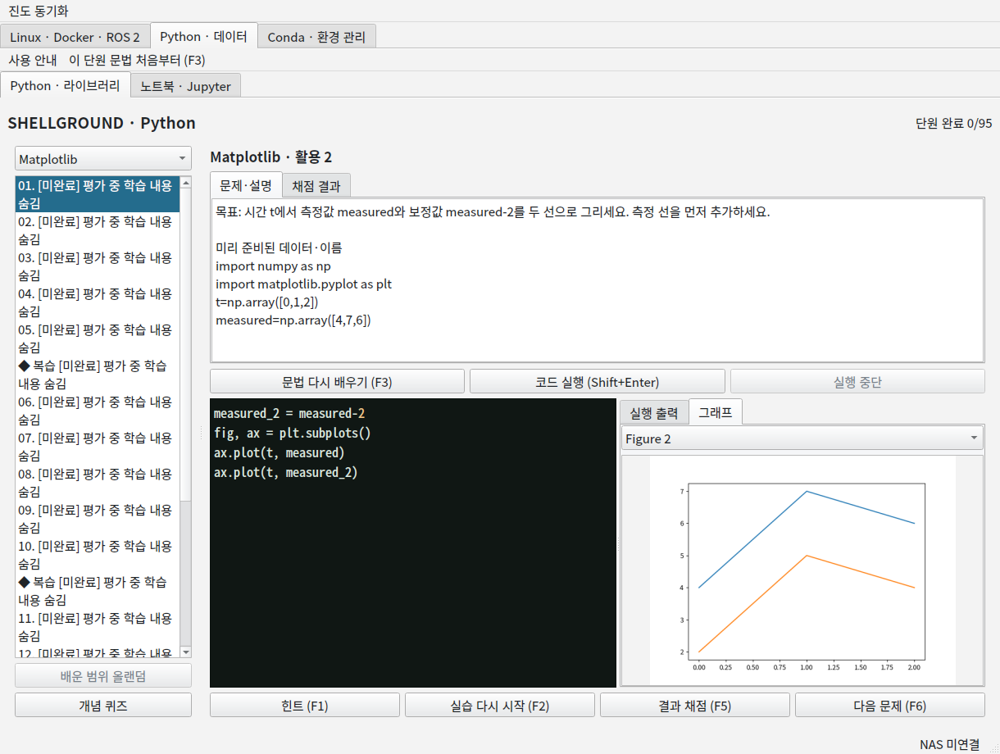
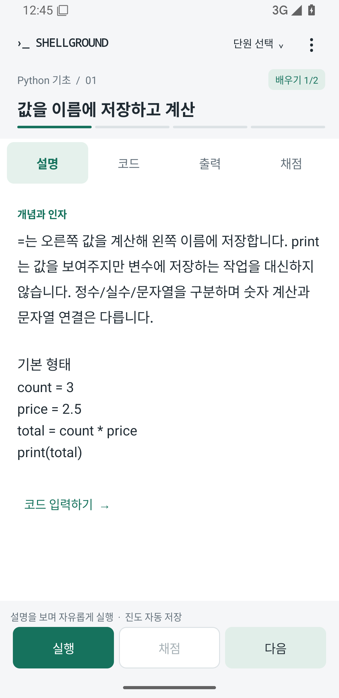

# 4.7.6 verification / 검증 기록

2026-09-22 KST. Application build source: `ebf20a591cfa4ca75bd7335ecda55e0e63584bc6`.

| Check | Result and boundary |
| --- | --- |
| Windows native CI | PASS: 37 changed-feature tests; installer C# type check; packaged Unicode pipes, single-window navigation, Shift+Enter, pandas steps, current Matplotlib figure/two-line grading and owned-process cleanup. |
| Linux native CI | PASS: changed-feature tests; packaged study UI and actual X11/installer startup checks. Existing full-course evidence was not replayed. |
| Android API 35 x86-64 emulator | PASS: four targeted instrumentation tests for Keystore encryption, Android/PC metadata conversion, one new pandas guided exercise, and current-figure ordering with visible errors. Normal app startup was also inspected. |
| Actual SMB transport | PASS: signed login, existing-profile read, one owned empty-snapshot write/read, atomic replacement and exact probe cleanup. Existing user snapshots were not edited. No endpoint or login appears in the public report. |
| Source privacy | No personal NAS markers in the explicit source publication set. Private progress/configuration/signing-key files are excluded. |
| Android artifact privacy | 8,428 changed/nested entries inspected; no personal NAS markers. 146 unchanged entries reuse the previously pinned baseline, including the unchanged VM pack. |
| Android update identity | APK version 4.7.6 / code 476; signing certificate matches 4.7.4, allowing an in-place update without deliberately resetting progress. |

[Native build and test run](https://github.com/kimwoo666/shellground/actions/runs/35620860833)

Android APK SHA-256:

```text
d36316845ddf1891ed335103fc63c5d7c999c83a942e10cf6e6452caf104d199
```

Android signing certificate SHA-256 (public certificate, not a signing key):

```text
d3a7e87f11d75837f3b95523c887bbbef0b08d690a0ebee5876847bf85814578
```

Windows setup SHA-256:

```text
3344afb570ff75c49a4d5823ca0622114691dc32d6f0060c58da13d3bafab3c6
```

Linux setup SHA-256:

```text
a0041b3d21ac5326ca13a0f93f7915f4e5bb49fcb4e0fabed1948e7616d641e0
```

## What this does not claim

No physical ARM Android phone, all Windows GPU/driver configurations, or complete new Linux/Docker/ROS 2 curriculum replay was tested. The VM/native components were reused unchanged. Windows CI uses a real Windows runner but is not the user's own PC. The actual SMB check uses the same Java transport on the host JVM; Android encryption and the Python bridge were separately exercised inside Android. These are complementary checks, not a claim of a phone-to-NAS hardware test.

안드로이드 실휴대폰의 발열·배터리·성능이나 모든 Windows PC의 호환성을 검증했다는 의미는 아닙니다. 기존 강의 전체를 다시 채점하지 않고, 이번에 바뀐 기능과 새 실행파일의 연결 부분만 확인했습니다. 실제 SMB 전송과 Android 내부 연결 검사는 위와 같이 구분합니다.

## Actual screens



<p></p>

These are captures of running applications, not generated mockups. The desktop plot capture is from the Linux 4.7.6 review build; the Android image is from the final 4.7.6 APK on the emulator.
